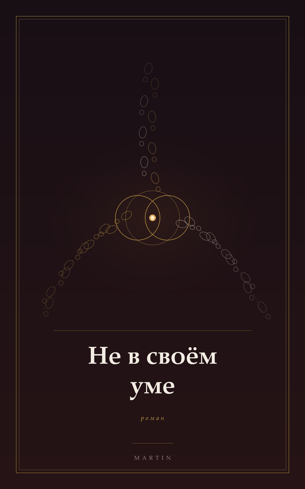

# Out of Their Minds

### «Не в своём уме» · *Nejsou při smyslech*

<p align="center">
  
</p>

A Dramione romantic comedy, written in Russian. *Harry Potter* fan fiction: canon world,
original plot, no crossover with anything but ordinary life.

**35 chapters · 108,423 words · 404 pages (A5)**

---

## The book

On 2 May 2009, eleven years to the day after the Battle of Hogwarts, Hermione Granger and Draco
Malfoy each sign the papers to foster a child from the last magical orphanage in Britain. That
night, in an attic, the two children find a book neither of them can read and attempt a rite that
is supposed to make one family out of two households.

They get the verb wrong.

Three days later the two adults wake up in each other's bodies — and over the following months, so
does the rest of the country. Hair goes wrong, fireplaces send people to the wrong houses,
Patronuses arrive in borrowed shapes, and by July nobody's handwriting is their own.

There is no villain in this book. There is a house, two children, ninety-nine nights, a cat with
opinions, and a dance at the end.

> Романтическая комедия в мире «Гарри Поттера». Лето 2009 года: двое приёмных детей неправильно
> переводят древний обряд, и вся Британия просыпается не в своём уме.

**Adults, 18+.** Slow burn, found family, magical mystery, and a great deal of domestic comedy.

## Download

**[→ Releases](../../releases)** — EPUB, MOBI and A5 PDF.

The EPUB opens in any reader, and Kindle has accepted EPUB directly since 2022, so Send-to-Kindle
works without conversion. The MOBI is there for Kindles old enough to predate that — it is MOBI 6
(KF7), which the earliest devices can still read.

## How it was written

The book was written one prompt at a time inside a system built to keep a hundred thousand words
coherent. That system is in this repository, and it is most of what makes the repository worth
reading:

- **Native Russian.** Written in Russian from the first sentence, never translated. Harry Potter
  terminology follows the Russian ROSMAN editions throughout (`bible/glossary.md`).
- **Bible-first.** No fact reaches the prose without a home in `bible/` — characters, world rules,
  the rite's law, the 2009 calendar — logged in the same step that first uses it.
- **A foreshadowing ledger.** Every plant has a named payoff chapter and vice versa
  (`bible/foreshadowing-ledger.md`), and each chapter's front-matter has to mirror it.
- **A quality gate.** `tools/gate.py` runs over the whole manuscript and has to be green before
  anything is kept: word bands, POV against the chapter card, ledger sync, forbidden lexicon,
  banned tics, and the genre law in `bible/style-guide.md` §0. `--selftest` proves every check
  still fires.
- **Reviewed by readers who did not write it.** Every chapter was read end to end by an independent
  reader, and the decisions that cost something are recorded in `docs/adr.md`, including the ones
  that turned out to be wrong.

**Written with AI.** The prose was drafted and revised with Claude inside the method above, directed
chapter by chapter by the author. The same disclosure is printed in the book's colophon.

## Layout

```
manuscript/   35 chapters — Markdown with YAML front-matter
bible/        characters · world rules · plot architecture · timeline · ledger · glossary · style guide
book/         front matter, colophon, cover, part divisions
tools/        gate.py (quality gate) · build.ps1 (EPUB/MOBI/PDF) · make-cover.py
docs/adr.md   architecture decision records — every expensive decision and why
dev_history.md
```

## Building it yourself

```bash
python tools/gate.py            # must be green
powershell tools/build.ps1      # EPUB + MOBI + A5 PDF into build/
```

Needs `pandoc`; the PDF also needs a Unicode LaTeX engine (`xelatex`, `lualatex` or `tectonic`),
and MOBI needs Calibre's `ebook-convert`.

## Rights

Non-commercial fan fiction. *Harry Potter* and its world are the creation and property of
J. K. Rowling; no copyright infringement is intended and no money changes hands. The original
characters, plot and text of this novel belong to the author.
